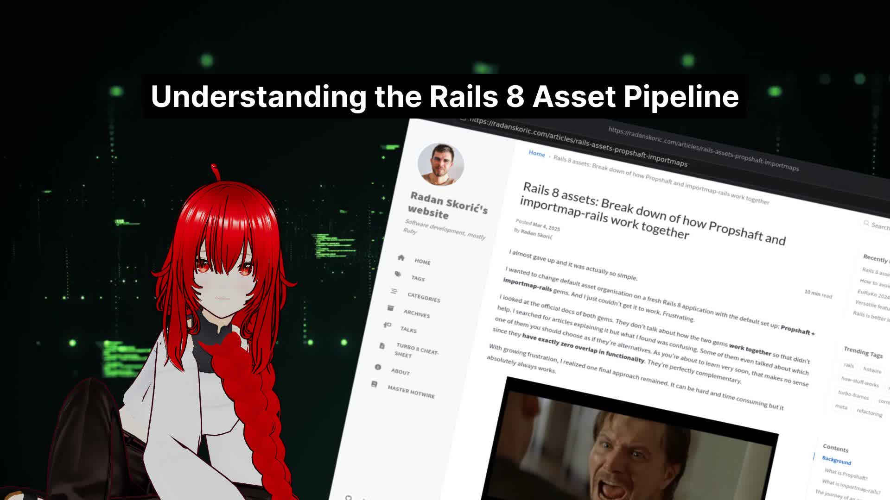

## Hi there 

I'm Arek, an Software Developer from Poland who is passionate about software development and hacking space.

### Current FUN projects

#### 📚 AI-Powered Book Reviews as VTuber Performances

Using AI to transform trending books into engaging VTuber content. Here's how it works:

1. Monitor [X](https://x.com) trends to identify popular books and literary discussions
2. Extract and validate book titles using [Qwen2.5](https://ollama.com/library/qwen2.5:0.5b) for accurate processing
3. Gather reviews across platforms and synthesize them using a combination of Gemini and [LLAMA](https://ollama.com/library/llama3.3) for balanced perspectives
4. Create immersive backgrounds with [ComfyUI SDXL](https://github.com/comfyanonymous/ComfyUI), generating scenes that match each book's setting and atmosphere
5. Present everything through a VTuber performance, making literature reviews more engaging and accessible

Recent Reviews:
|  |  |
|----------|----------|

🎥 Discover more literary adventures on [YouTube](https://www.youtube.com/@BelleArctique/shorts)

#### 📚 24H AI TV station

Your Ruby on Rails News Stream: A 24-hour live TV stream delivering the latest Ruby on Rails updates and trending programming blog posts converted into bite-sized summaries. Stay informed with current development trends instead of watching depressing news networks like CNN or FOX in the background. The perfect ambient companion for developers who want to keep up with the Rails ecosystem while working.

Go to https://www.youtube.com/@BitsBytesByEliza/streams for live stream.

### 📫 How to reach me:

### ⚡ Technologies

- Backend development, using **Ruby** or **Ruby On Rails**
- Frontend - **React/MobX/Typescript**
- Native Mobile Apps - **React Native** and **Java**
- Blockchain - **Ethereum/Solidity**
- Containers - **Docker/Docker Compose/Treafik**
- Server Management - **Ansible/Terraform/Linux(debian distros)**
- Smart Home - **HomeAssistant** and **Python**

### ✨ My contributions on github

